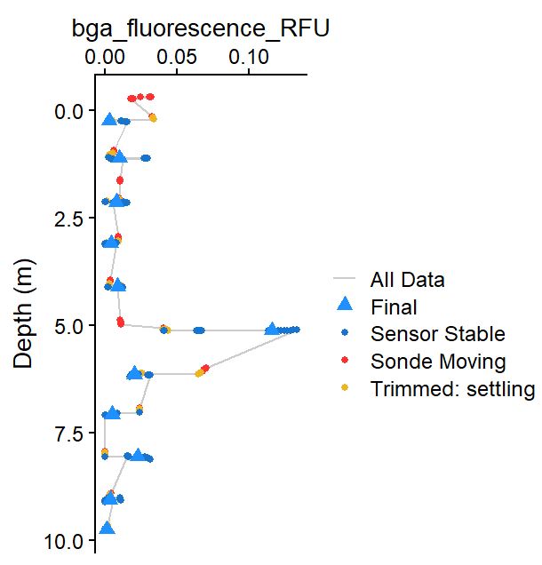

# TROLL Profiles Quick Start

## Quick Start

``` r
library(ImportUtils)

# Example data (replace with your own file path)
path_to_raw <- system.file("extdata", "TROLL_exdata.csv", package = "ImportUtils")

## Run the full workflow
dat <- TROLL_profile_compiler(
  path = path_to_raw, 
  stn_secs = 24      # adjusted for this dataset
)

# View summarized output
summary <- dat$Summary_Data
summary
#> # A tibble: 9 × 8
#>   stationary_depth sp_conductivity_uScm temperature_C pH_units DO_mgL
#>              <dbl>                <dbl>         <dbl>    <dbl>  <dbl>
#> 1            0.085                 66.8         18.0      7.26   9.85
#> 2            1.04                  66.6         18.1      7.41   9.86
#> 3            1.94                  66.3         17.5      7.33   9.68
#> 4            2.90                  66.7         16.1      7.00   9.09
#> 5            3.91                  65.7         15.3      6.74   8.02
#> 6            4.88                  67.2         12.7      6.53   6.43
#> 7            5.84                  66.9         10.6      6.36   5.08
#> 8            6.82                  67.0          9.83     6.12   4.05
#> 9            7.68                  68.9          9.52     5.84   2.38
#> # ℹ 3 more variables: chlorophyll_RFU <dbl>, turbidity_NTU <dbl>,
#> #   bga_fluorescence_RFU <dbl>
```

**NOTE**: This example uses `stn_secs = 24` because the included dataset
has short stationary periods.

**Figure 1**: Example output showing
compiled profile data for BGA (RFU).

If results are not as expected:

- Missing depths –\> decrease `stn_secs`
- Noisy non-optical parameter data –\> adjust `stbl_range_thresholds`
- Want to inspect behavior –\> rerun with `plot = TRUE`

For more control, see the *Tuning Troll Workflow* vignette.
