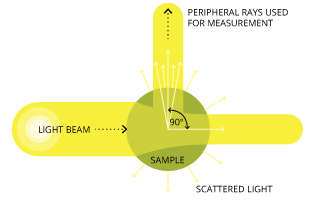

```{r setup, include=FALSE, warning=FALSE}
knitr::opts_chunk$set(echo = TRUE, warning = FALSE)
library(ImportUtils)
library(tidyverse)

data_read <- TROLL_read_data(path = '2025-10-07_QL1.csv')
data_rename <- TROLL_rename_cols(data_read)
```

## Example Data

These data are from Quaker Lake, collected as part of the NYS Parks ultrasonic monitoring project on October 7, 2025. 
We will examine **turbidity, chlorophyll, and BGA** readings. 

  1. Date were read in using `TROLL_read_data()` followed by `TROLL_rename_cols()` with default settings. 
  2. Stationary blocks of data were extracted using:

```r
data_stationary <- is_stationary(
  data_rename,
  stationary_secs = 22, 
  start_trim_secs = 4,
  plot = TRUE
)
```
  **NOTE** the specific settings. These were tuned to extract stationary blocks at 1m intervals using the optional plot. 
    
  3. Stability was determined using the settings shown with `TROLL_sensor_stable()` for each parameter independently

## How Optical Sensors Work

I think that, to understand the data, it helps to understand how optical sensors detect their target parameter. 
For both turbidity and chlorophyll, In-Situ sensors measure using "Nephelometry", the amount of light scattered 
at a 90 degree angle from transmitted light. An image is helpful:




With that in mind we can examine some stationary blocks of data more closely. 

```{r, echo=FALSE,include=TRUE,fig.align='left',fig.width=7,fig.height=3, fig.cap='Figure 1: Turbidity data as a timeseries.'}
data_stationary <- is_stationary(
  data_rename,
  stationary_secs = 22,
  start_trim_secs = 4
)

turb_stable <- TROLL_sensor_stable(data_stationary,
                                   value_col = turbidity_NTU,
                                   range_thresh =7,
                                   slope_thresh = 0.5,
                                   plot = T) %>% 
  filter(is_stationary_status == 999) %>% 
  select(DateTime,stationary_depth,turbidity_NTU,turbidity_NTU_stable) %>% 
  group_by(stationary_depth) %>% 
  group_split()
```
It's clear here that we have 3 distinct turbidity levels, and each exhibit considerable noise (sometimes drift), but that
noise is scaled with the absolute NTU value. **NOTE** that in Figure 1, the range threshold (horizontal lines) and, slope
threshold have been relaxed from defaults. 

Let's examine the "bounciest" stationary block from 9 meters. 


```{r, echo=FALSE,include=TRUE,fig.align='left',fig.width=7,fig.height=3, fig.cap='Figure 2: Turbidity data within the 9 m stationary block.'}
pdat <- turb_stable[[10]]

p1 <- 
ggplot(pdat,
       aes(x = DateTime, y = turbidity_NTU, color = as.factor(turbidity_NTU_stable))) + 
  geom_point()
p1

```

If we had relied upon the default behavoir of `TROLL_sensor_stable()`, the function would not have detected stability
because the default range threshold (`range_thresh`) for turbidity is never met. 

```{r, echo=FALSE, include=TRUE, warning=FALSE, message=FALSE}
library(knitr)
library(kableExtra)

kable(stability_ranges) %>%
  kable_styling(position = "center", full_width = FALSE)
# knitr::kable(stability_ranges, align = 'c')
```

However, if we relax this to a point where the range threshold is always met (as in Figure 1), then we rely solely upon slope to 
detect stability. The default for all parameters `slope_thresh` is current set at 0.05 units/minute, and is only customizable 
globally within the `TROLL_profile_compiler()` function. Since we are working outside of that wrapper function, we can adjust
`slope_thresh` for individual parameters. 

**Using a value of 0.5 NTU/min, coupled with the unrestrictive `range_thresh` value, results in Figure 1, where most data within
stationary blocks are considered stable**

```{r, warning = FALSE, message = FALSE,echo=FALSE,include=TRUE,fig.align='left',fig.width=7,fig.height=3, fig.cap='Figure 2: Turbidity data within the 9 m stationary block.'}
p_med <- median(pdat$turbidity_NTU[pdat$turbidity_NTU_stable==T])
p_all <-  median(pdat$turbidity_NTU)

pdat <- pdat %>% 
  mutate(dttm_norm = (DateTime - min(DateTime)) / 60)
p2 <- 
ggplot(pdat,
       aes(x = dttm_norm, y = turbidity_NTU)) + 
  geom_point(aes(color = as.factor(turbidity_NTU_stable))) +
  geom_smooth(method = 'lm',se=F, col = 'red') + 
  geom_smooth(data = pdat %>% filter(turbidity_NTU_stable ==T),
              aes(x = dttm_norm, y = turbidity_NTU, color = as.factor(turbidity_NTU_stable)),
              method = 'lm',se=F) +
  geom_hline(yintercept = p_med,
             col = 'blue',lty= 2) + 
  geom_hline(yintercept = p_all,
             col = 'red',lty = 2)
p2

```
In this case, the results do not differ whether we use all the data (red dashed line) or just the data extracted by the 
function. We can see that once the slope threshold is met, all the data are used to compute the median as the output. 
However, the real interesting thing is the pattern of noise in the data. 

**I believe that this is the result real world variability in particulates moving in front of the sensor**

If you look at the image of how optical sensors work, you can imagine that as a particle moves in front of the sensor, it reflects light. 
Additionally, as it moves past, it will scatter the light differentially but in a relatively uniform pattern. 

**To examine this we can look at a plot of the lagged differences in the turbidity data**.

```{r echo=FALSE, fig.align='left', fig.cap='Figure 3: Lagged differences in turbidity data', fig.height=3, fig.width=7, message=FALSE, warning=FALSE, include=TRUE}
dplot_dat <- 
pdat %>% 
  mutate(jumps = c(NA,diff(turbidity_NTU)))

dplot = 
ggplot(dplot_dat,
       aes(x = DateTime, y = jumps, color = as.factor(turbidity_NTU_stable))) + 
  geom_point()
dplot
```
What stands out to me is that, while the large jumps are obvious, there are very consistent differences for about 16 seconds at a time. 
I suspect this is a result of different types of particulates moving past the sensor, so as they are scattering more or less light 
as they move by, causing this distinct pattern. 

A couple of things result from this illustration: 

  1. These appear to be real data, and the sensor appears to respond rapidly, as the <1 second T95 value suggests (in contrast to pH, DO, and temperature)
  2. To accurately convey these data in a report, we need to incorporate an adequate amount of this noise
  3. There really is no realm where we shouldn't be reporting a measure of variability (standard deviation) around our reported median

## Chlorophyll/BGA

The chlorophyll/BGA sensor on the AquaTrolls are also optical with T95 times of < 1 second. 

```{r echo=FALSE, fig.align='left', fig.cap='Figure 4: Complete chlorophyll cast data.', fig.height=3, fig.width=7, message=FALSE, warning=FALSE, include=TRUE}
chl_stable <- TROLL_sensor_stable(data_stationary,
                                  value_col = chlorophyll_RFU,
                                  plot = T) %>%
  filter(is_stationary_status == 999) %>%
  select(DateTime,stationary_depth,chlorophyll_RFU,chlorophyll_RFU_stable) %>%
  group_by(stationary_depth) %>%
  group_split()

chl_stable <- chl_stable[[6]]
```

In this figure we see that, despite having fewer stationary blocks with high RFU values compared to high NTU for turbidity, there is a similar pattern to turbidity, 
where the data are noisier at higher levels, and it seems that there are consistent linear shifts in readings punctuated by large "jumps". This sensor behavior seems
consistent with particulates impacting the optical field as before. 

```{r echo=FALSE, fig.align='left', fig.cap='Figure 4: Complete BGA cast data.', fig.height=3, fig.width=7, message=FALSE, warning=FALSE, include=TRUE}
bga_stable <- TROLL_sensor_stable(data_stationary,
                                  value_col = bga_fluorescence_RFU,
                                  plot = T) %>%
  filter(is_stationary_status == 999) %>%
  select(DateTime,stationary_depth,bga_fluorescence_RFU,bga_fluorescence_RFU_stable) %>%
  group_by(stationary_depth) %>%
  group_split()

bga_stable <-bga_stable[[6]]

```

A similar pattern to chlorophyll is seen in the BGA data, except there is a little more noise at low RFU values. Of note here, the default `range_thresh` for
`TROLL_sensor_stable` is set to 0.02, which is quite restrictive. The default in the stability ranges dataset is currrently 0.3, which is much more lenient. 
The internal ranges dataset was based on compilation of actual data, but the optical sensors were highly variable among casts/locations, so it was hard to 
pick a single value. 


## Path Forward

So where does that leave us? 

I think that if we ensure ample trimming at the start of the stationary blocks with the `start_trim_secs` argument of `is_stationary()`,
there is no reason to discard data for optical sensors throughout the remainder of the stationary period, with one caveat. 

**It may be prudent to check for and remove outliers with high influence on the result of the summary statistic (median by default)**. 

In the BGA data (Figure 4) there is a relative spike near the beginning of the 1 m stationary block, which is excluded right now based on the `range_thresh` value. 
While this could be real, given the relative brevity of our sonde hold times at each depth relative to the noise, this could be candidate for removal based 
on an outlier detection routine. 


